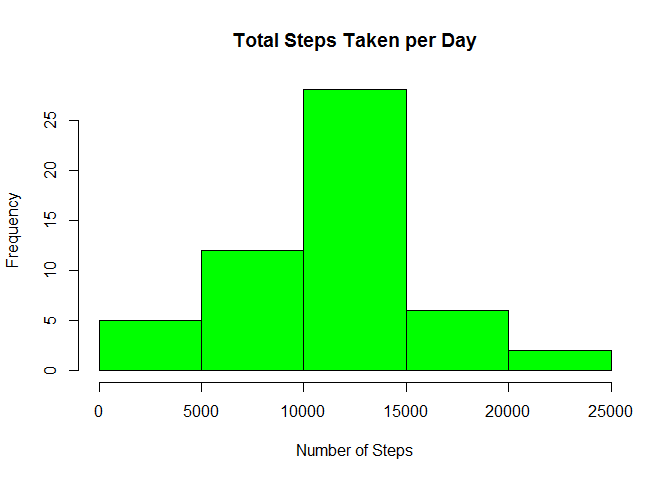
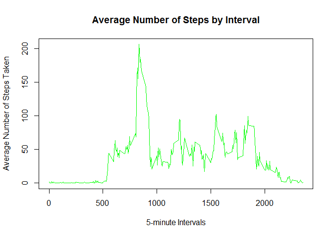
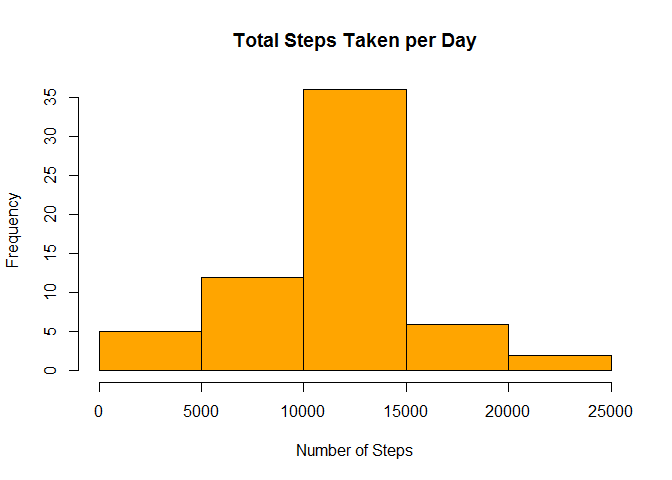
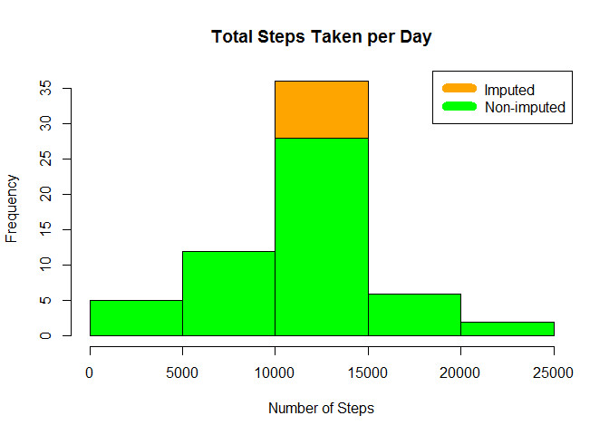
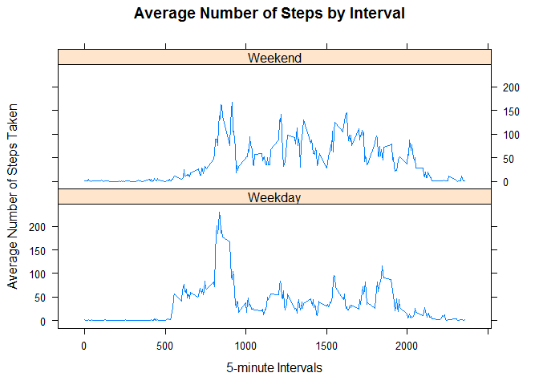

###### Loading data:

    #setwd("ReproducibleResearch/")
    activity <- read.csv("activity.csv")

### What is mean total number of steps taken per day?

-   Total number of steps taken per day:

<!-- -->

    totalSteps <- aggregate(steps ~ date, activity, sum)
    head(totalSteps)

    ##         date steps
    ## 1 2012-10-02   126
    ## 2 2012-10-03 11352
    ## 3 2012-10-04 12116
    ## 4 2012-10-05 13294
    ## 5 2012-10-06 15420
    ## 6 2012-10-07 11015

-   Histogram of the total number of steps taken each day:

<!-- -->

    hist(totalSteps$steps, main = paste("Total Steps Taken per Day"), col="green", xlab="Number of Steps", ylab="Frequency")

-   Mean number of steps

<!-- -->

    meanSteps <- mean(totalSteps$steps, na.rm = TRUE)
    meanSteps

    ## [1] 10766.19

-   Median number of steps

<!-- -->

    medianSteps <- median(totalSteps$steps, na.rm = TRUE)
    medianSteps

    ## [1] 10765

### What is the average daily activity pattern?

    stepsInterval <- aggregate(steps ~ interval, activity, mean)
    head(stepsInterval)

    ##   interval     steps
    ## 1        0 1.7169811
    ## 2        5 0.3396226
    ## 3       10 0.1320755
    ## 4       15 0.1509434
    ## 5       20 0.0754717
    ## 6       25 2.0943396

-   Plot of Average number of steps by interval:

<!-- -->

    plot(stepsInterval$interval, stepsInterval$steps, type="l", col="green", xlab="5-minute Intervals", ylab="Average Number of Steps Taken",main="Average Number of Steps by Interval")

-   Which 5-minute interval, on average across all the days in the
    dataset, contains the maximum number of steps?

<!-- -->

    intervalWMaxSteps <- stepsInterval[which.max(stepsInterval$steps),1]
    intervalWMaxSteps

    ## [1] 835

    plot(stepsInterval$interval, stepsInterval$steps, type="l", col="green", xlab="5-minute Intervals", ylab="Average Number of Steps Taken",main="Average Number of Steps by Interval")
    abline(v = 835, col = "orange")

### Imputing missig values:

-   Number of rows with missing values:

<!-- -->

    incompleteActivity <- sum(is.na(activity))
    incompleteActivity 

    ## [1] 2304

-   All the missing values were filled in with mean number of steps

<!-- -->

    imputedActivity <- activity
    nas <- is.na(imputedActivity$steps)
    meanInterval <- tapply(imputedActivity$steps, imputedActivity$interval, mean, na.rm=TRUE, simplify=TRUE)
    imputedActivity$steps[nas] <- meanInterval[as.character(imputedActivity$interval[nas])]

-   Histogram of Total steps taken per day using imputed data

<!-- -->

    totalStepsImputed <- aggregate(steps ~ date, imputedActivity, sum)
    hist(totalStepsImputed$steps, main = paste("Total Steps Taken per Day"), col="orange", xlab="Number of Steps", ylab="Frequency")

-   Histogram that show difference between imputed and non-imputed data

<!-- -->

    hist(totalStepsImputed$steps, main = paste("Total Steps Taken per Day"), col="orange", xlab="Number of Steps", ylab="Frequency")
    hist(totalSteps$steps, main = paste("Total Steps Taken per Day"), col="green", xlab="Number of Steps", ylab="Frequency", add=T)
    legend("topright", c("Imputed", "Non-imputed"), col=c("orange", "green"), lwd=10)

-   Mean, meadian using imputed data

<!-- -->

    meanStepsImputed <- mean(totalStepsImputed$steps)
    medianStepsImputed <- median(totalStepsImputed$steps)
    meanStepsImputed

    ## [1] 10766.19

    medianStepsImputed

    ## [1] 10766.19

-   The following difference is observed between imputed and non-imputed
    data:

<!-- -->

    meanD <- meanStepsImputed - meanSteps
    medianD <- medianStepsImputed - medianSteps
    totalD <- sum(totalStepsImputed$steps) - sum(totalSteps$steps)
    meanD

    ## [1] 0

    medianD

    ## [1] 1.188679

    totalD

    ## [1] 86129.51

### Are there differences in activity patterns between weekdays and weekends?

-   Creating a new factor variable in the dataset with two levels -
    "weekday" and "weekend" indicating whether a given date is a weekday
    or weekend day:

<!-- -->

    weekdays <- c("Monday", "Tuesday", "Wednesday", "Thursday", "Friday")
    imputedActivity$day = as.factor(ifelse(is.element(weekdays(as.Date(imputedActivity$date)),weekdays), "Weekday", "Weekend"))

-   Panel plot containing a time series plot (i.e. type = "l") of the
    5-minute interval (x-axis) and the average number of steps taken,
    averaged across all weekday days or weekend days (y-axis):

<!-- -->

    stepsInterval <- aggregate(steps ~ interval + day, imputedActivity, mean)

    library(lattice)

    xyplot(stepsInterval$steps ~ stepsInterval$interval|stepsInterval$day, main="Average Number of Steps by Interval",xlab="5-minute Intervals", ylab="Average Number of Steps Taken",layout=c(1,2), type="l")

